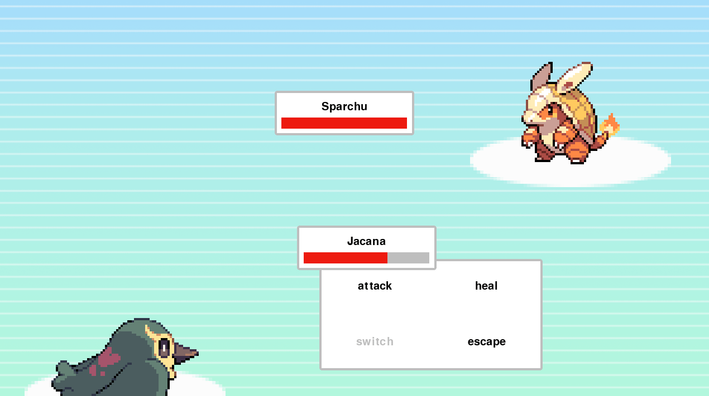

# ⚔️ Gauntlet Legends

A turn-based monster battling RPG built with Python and Pygame. Assemble your team of creatures, exploit elemental weaknesses, and defeat opponents in tactical combat inspired by classics like Pokémon.

<p align="center">
  
</p>

---

### 🎮 Features

*   **Turn-Based Combat System:** Classic RPG gameplay where you and your opponent take turns choosing actions.
*   **Elemental Mechanics:** Strategic damage system based on elements (**Fire**, **Water**, **Plant**). Use the right element to deal double damage!
    *   🔥 Fire burns Plant
    *   💧 Water douses Fire
    *   🌿 Plant absorbs Water
*   **Team Management:** You command a roster of 5 different monsters (Sparchu, Cleaf, Jacana, Atrox, Pouch). Switch them out during battle to gain a tactical advantage.
*   **Battle Actions:** Choose between **Attack**, **Heal** (restore HP), **Switch** (change active monster), or **Escape**.
*   **Animated Abilities:** Visual effects for different attack types (scratches, explosions, splashes, energy beams).
*   **Dynamic UI:** Interactive menus and health bars that update in real-time to reflect the battle state.

---

### 🕹️ Controls

| Key         | Action       |
| :---------- | :----------- |
| **↑ ↓ ← →** | Navigate Menus |
| **Spacebar**| Confirm / Select |
| **Esc**     | Go Back / Cancel |

---

### ⚙️ Setup and Installation

To run this game, you'll need Python and the Pygame library.

1.  **Install Pygame:**
    ```bash
    pip install pygame
    ```

2.  **Run the Game:**
    Navigate to this directory from the root of the repository and run the main script.
    ```bash
    python main.py
    ```
