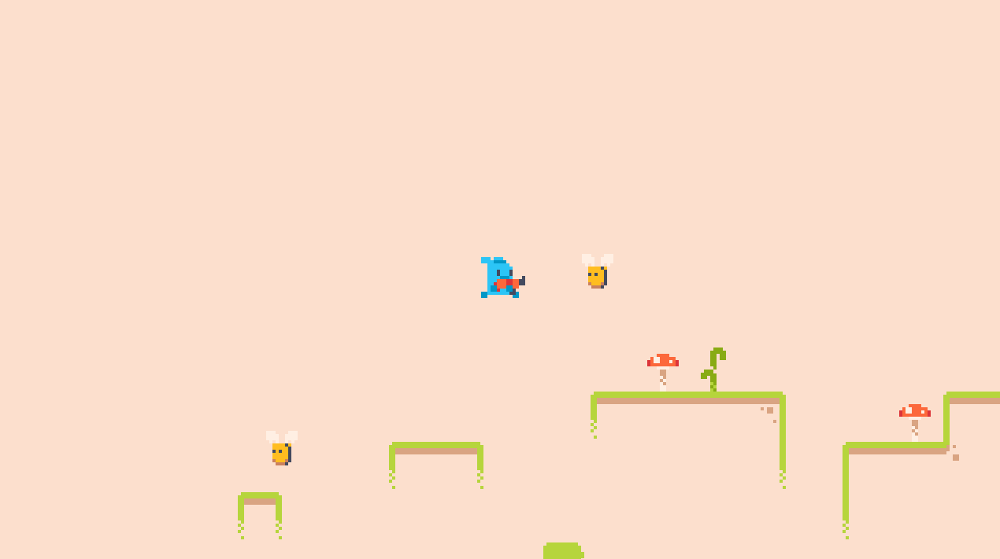

# 🐰 Lapine

A classic side-scrolling action platformer built with Python and Pygame. Take control of a brave rabbit and defend yourself against an infestation of worms and bees.

<p align="center">
  
</p>

---

### 🎮 Features

*   **Rabbit Agility & Double Jump:** Use your bunny reflexes to perform mid-air jumps and reach high ledges.
*   **Ranged Combat:** Armed with a weapon, you can shoot projectiles to clear the path of enemies.
*   **Distinct Enemy Behaviors:**
    *   **Worms:** Ground-based pests that patrol platforms back and forth.
    *   **Bees:** Airborne threats that swarm in continuously using a sine-wave flight pattern.
*   **Tiled Map Integration:** A rich world built with Tiled (`.tmx`), featuring detailed platforms and decorations.
*   **Animated Sprites:** Smooth animations for the rabbit running, enemies moving, and combat effects.
*   **Audio Atmosphere:** Includes sound effects for shooting, and impacts, set to background music.

---

### 🕹️ Controls

| Key         | Action       |
| :---------- | :----------- |
| **← / →**   | Move Rabbit Left/Right |
| **↑**       | Jump (Press again for Double Jump) |
| **Spacebar**| Shoot        |

---

### ⚙️ Setup and Installation

To run this game, you'll need Python, **Pygame**, and the **PyTMX** library (used for loading the level map).

1.  **Install Dependencies:**
    Open your terminal or command prompt and run:
    ```bash
    pip install pygame pytmx
    ```

2.  **Run the Game:**
    Navigate to this directory from the root of the repository and run the main script.
    ```bash
    python main.py
    ```
