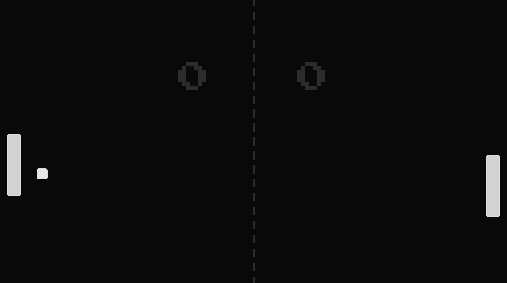

# 🏓 Pong

A polished recreation of the arcade classic using Python and Pygame. Challenge an AI opponent in this fast-paced test of reflexes, featuring retro aesthetics.

<p align="center">
  
</p>

---

### 🎮 Features

*   **Single Player vs AI:** Play against a responsive computer opponent that tracks the ball's movement.
*   **Dynamic Difficulty:** The ball speed increases with every paddle hit, making rallies progressively harder.
*   **Precise Physics:** Robust collision detection (using previous frame positions) ensures the ball bounces correctly off paddles and walls.
*   **Retro Audio & UI:** Includes classic arcade sound effects for hits/scores and a pixel-art font interface.
*   **Score Tracking:** Real-time score display for both the player and the opponent.

---

### 🕹️ Controls

| Key         | Action       |
| :---------- | :----------- |
| **↑ / ↓**   | Move Paddle Up/Down |

---

### ⚙️ Setup and Installation

To run this game, you'll need Python and the Pygame library.

1.  **Install Pygame:**
    ```bash
    pip install pygame
    ```

2.  **Run the Game:**
    Navigate to this directory from the root of the repository and run the main script.
    ```bash
    python main.py
    ```
